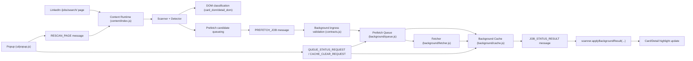

# LinkedIn Reposted Marker Architecture

This document focuses on implementation details. For setup and day-to-day usage, see [README.md](README.md).

## Overview

The extension targets LinkedIn Jobs pages and follows a reliability-first design:

- strict runtime contracts for route and payload validation
- deterministic queue and cache behavior
- DOM-first detection with background prefetch augmentation
- observable runtime state in popup and debug logs

Core capabilities:

- visible DOM detection for reposted jobs
- background prefetch for unresolved jobs
- job ID mapping and cache reuse across rerenders
- viewport-aware prefetch windowing and bounded queueing
- popup controls for runtime behavior and local settings

## Current Implementation Status

- Milestone 1: DOM-first detection and highlighting
- Milestone 2: job ID mapping, card registry, and in-page cache reuse
- Milestone 3: background prefetch queue with async updates
- Milestone 4: viewport-aware prefetch windowing and queue prioritization
- Runtime hardening: shared contracts, shared cache policy, queue observability
- Control menu: popup settings, diagnostics, cache reset, and debug log export

## Route Support Matrix

| Route | Supported |
| --- | --- |
| `/jobs/search/` | Yes |
| `/jobs/search-results/` | No |
| Other LinkedIn pages | No |

Route checks are centralized in `shared/contracts.js` and used by both content and background boundaries.

## Project Structure

```text
extension/
  manifest.json
  assets/
  background/
    cache.js
    fetcher.js
    index.js
    queue.js
  content/
    cache.js
    card-registry.js
    detector.js
    index.js
    job-id.js
    messaging.js
    observer.js
    prefetch.js
    scanner.js
    styler.js
  shared/
    cache-policy.js
    constants.js
    contracts.js
    debug-log.js
    settings.js
    utils.js
  styles/
    injected.css
  ui/
    popup.html
    popup.js
```

## Runtime Contracts

### PREFETCH_JOB (content -> background)

Validated in `shared/contracts.js` before enqueue:

```json
{
  "jobId": "1234567890",
  "url": "https://www.linkedin.com/jobs/view/1234567890/",
  "priority": 120,
  "forceRefresh": false
}
```

### JOB_STATUS_RESULT (background -> content)

Validated in `shared/contracts.js` before apply:

```json
{
  "jobId": "1234567890",
  "status": "reposted",
  "source": "prefetch",
  "timestamp": 1713800000000,
  "nextRetryAt": null
}
```

## Source Precedence and Resolution

Source priority is centralized in `shared/constants.js`:

1. `prefetch` (highest)
2. `detail_dom`
3. `card_dom`

Replacement rules are centralized in `shared/cache-policy.js`:

- higher-priority source can override lower-priority source
- newer records can override same-priority older records
- `error` and `rate_limited` do not replace valid reposted states
- `unknown` is fallback-only

## Queue State Model

Background queue (`background/queue.js`) maintains explicit states:

- `pending`
- `active`
- `completed`
- `released`
- `requeue` (when paused)

Pause handling is explicit:

- queue pauses on rate-limited records
- pause reason and resume time are tracked
- scheduler resumes automatically after pause window

Exposed runtime status:

```json
{
  "pending": 0,
  "active": 0,
  "paused": false,
  "pausedUntil": null,
  "pauseReason": null
}
```

## Cache Policy

Content and background caches share one policy module: `shared/cache-policy.js`.

Shared concerns:

- TTL freshness checks (`isFresh`)
- stale refresh criteria (`shouldRefresh`)
- authority-aware replacement (`shouldReplaceRecord`)
- retry windows for `error` and `rate_limited`

Background cache additionally provides:

- bounded in-memory cache
- eviction stats
- `clearAll()` and `pruneExpired()` controls

## Runtime Flow

1. The content script scans LinkedIn job-card anchors and extracts job IDs.
2. Visible card text and detail-panel text are checked first.
3. Unknown jobs near the viewport are queued for background prefetch.
4. Background ingress validates sender route and payload before queueing.
5. The background worker fetches LinkedIn job pages, classifies status, stores policy-checked cache records, and returns results to relevant tabs.
6. Cached results are reused immediately and refreshed opportunistically for stale nearby cards.
7. Popup settings and operator actions (`Rescan Page`, `Clear Cache`) are applied live.

## Mermaid Architecture Diagram



## Popup Diagnostics and Operator Actions

Popup shows real runtime diagnostics from background:

- Page Support
- Queue Status
- Cache Status

Popup operator actions:

- Rescan current supported page
- Clear background cache and release pending queue tasks
- Download and clear debug logs

## Verification Checklist

Manual checks for the current build:

1. On `/jobs/search/`, popup `Page Support` reports `Supported`.
2. On `/jobs/search-results/`, popup reports unsupported and no scanning is applied.
3. A visible left-list job card containing `Reposted` is highlighted automatically.
4. Opening a reposted job highlights the detail panel.
5. A left-side unknown card can become highlighted after prefetch result returns.
6. Queue status updates while scrolling and does not grow without bounds.
7. `Clear Cache` clears cache and releases pending queue tasks.
8. Updating popup settings changes behavior on already-open supported tabs.
9. Debug log export downloads a JSON file after reproducing an issue.

## Limitations

- Prefetch classification still relies on text matching in fetched LinkedIn HTML.
- Selector and parser adjustments may be needed if LinkedIn changes markup.
- Queue status and cache diagnostics are lightweight, not full tracing.
- There is no automated browser test harness in the repository yet.

## Roadmap

- Milestone 5: testing and CI hardening for queue/cache/message contracts
- Milestone 6: deeper diagnostics and optional options page
- Milestone 7: advanced multi-state job markers
