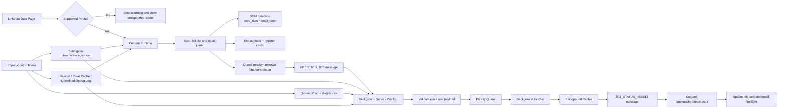

# LinkedIn Reposted Marker

LinkedIn Reposted Marker is a Chrome and Edge extension that highlights reposted LinkedIn job listings so you can scan job results faster.

## What It Does

- Highlights reposted jobs in the left jobs list
- Highlights reposted jobs in the right detail panel
- Prefetches unresolved jobs in the background
- Reuses local cache to reduce duplicate work
- Shows runtime diagnostics in the popup (page support, queue, cache)

## High-Level Flow

## Installation

### Option 1: Download ZIP from GitHub
1. Download this repository as a ZIP file from GitHub (`Code` -> `Download ZIP`).
2. Unzip the downloaded file.
3. Open `chrome://extensions` or `edge://extensions`.
4. Enable Developer Mode.
5. Click `Load unpacked`.
6. Select the extracted `reposted-marker/extension` directory.
7. If you update the source later, reload the extension in the browser.

### Option 2: Clone with Git
If you cloned the repository with Git, skip the ZIP and unzip steps and load the unpacked extension directly.

## Quick Start

1. Open `https://www.linkedin.com/jobs/search/`.
2. Open the extension popup.
3. Ensure `Extension Enabled` is on.
4. Ensure `Background Prefetch` is on (recommended).
5. Confirm `Page Support` in popup shows `Supported`.

## Supported Routes

| Route | Supported |
| --- | --- |
| `/jobs/search/` | Yes |
| `/jobs/search-results/` | No |
| Other LinkedIn pages | No |

If the current page is not supported, scanning and highlighting are intentionally disabled.

## Control Menu

### Toggles
- Extension Enabled
- Background Prefetch
- Mark Left List
- Mark Detail Panel
- Debug Mode

### Ranges
- Prefetch Window
- Prefetch Concurrency
- Cache TTL

### Runtime Diagnostics
- Page Support
- Queue Status
- Cache Status

### Actions
- Rescan Page
- Clear Cache
- Download Debug Log
- Clear Log

## Runtime Notes

- Canonical route and payload validation is enforced in shared contracts.
- Queue behavior is bounded and observable (`pending`, `active`, `paused`).
- Cache freshness and replacement authority are shared between content and background.
- Background fetch timeout and retry windows are settings-driven.

## More Docs

- Architecture and technical details: [Architecture.md](Architecture.md)
